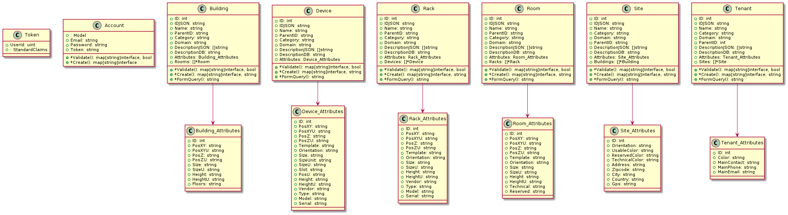

# Notes for The API
Designed with JWT, CockroachDB and CI tested using Jenkins and docker with a
script to start up CockroachDB


Introduction
------------
This is an API interfacing with a CockroachDB cluster for data centre management.


Building
------------
This is not yet tested on Windows and macOS   
The ReadMe assumes that you already have GO installed and your Environment PATHS properly setup  
You must also get [CockroachDB](https://www.cockroachlabs.com/docs/stable/install-cockroachdb-linux.html)  
For BSD systems, GO can be installed from the respective ports  
For Linux, consult your respective Distribution docs  

[Otherwise you can follow instructions from the GO site](https://golang.org/doc/install)  
   
  Clone the API repository  
  Execute go build main.go It should automatically retrieve the necessary libraries. If not then execute the command below to obtain the following packages
  ```
  go get github.com/dgrijalva/jwt-go github.com/fsnotify/fsnotify github.com/gorilla/mux github.com/jinzhu/gorm github.com/joho/godotenv github.com/lib/pq github.com/magiconair/properties github.com/mitchellh/mapstructure github.com/pelletier/go-toml github.com/spf13/afero github.com/spf13/cobra golang.org/x/crypto golang.org/x/sys golang.org/x/text gopkg.in/ini.v1  
  ```  

   Execute go build main.go


Running
-------------
You can modify the port of the API in the .env file 
 - Execute the bash script start.sh
 - Execute ```go run main.go```

Anatomy
-------------
The API follows the [MVC Architecture](https://en.wikipedia.org/wiki/Model%E2%80%93view%E2%80%93controller) using an [Active Record](https://en.wikipedia.org/wiki/Active_record_pattern) Persistence Pattern (Managed by the Model)   
The code is divided into isolated components where each component performs a certain set of tasks. The Model manages the Data and interacts with the Database   
The Controller interacts with the View and Model   
The View is the front end   
<p align="center">
  
</p>


   
This design was chosen to follow the microservices design for scalability and potential reuse in other projects such as GANDALF
   
API Files
-------------
   
### Folder Structure   
```
├─app   
├─controllers   
├─models    
├─resources   
├───diagrams   
└─utils   
```
    

The 'app' dir contains error and authentication files  
The 'controllers' dir contains controller files  
The 'models' dir contains model files  
The 'resources' dir contains SQL files and DB Diagram information   
The 'utils' dir contains useful functions for JSON messaging

### Files of Interest in the root directory  
```
- start.sh   
- main.go  
- .env   
- doc.go   
- swagger.json   
- Jenkinsfile   
- Dockerfile   
```

   
The start.sh is a script to start the CockroachDB   
main.go is the entry of the API  
.env contains variables useful for the API  
doc.go & swagger.json are OpenAPI documentation files   
Jenkinsfile will be used to implement a CI Pipeline later  
Dockerfile is a file for docker to create a container of the API  


### API UML   



Jenkins
--------------------------

### Jenkins Standalone

### External URL
```
api.chibois.net
```

This is easier but less portable 
Execute the following:
```
wget -q -O - https://pkg.jenkins.io/debian/jenkins.io.key | sudo apt-key add -
sudo sh -c 'echo deb https://pkg.jenkins.io/debian binary/ > \
    /etc/apt/sources.list.d/jenkins.list'
sudo apt-get update
sudo apt-get install jenkins
```

I then got an error with Failed to start LSB: Start Jenkins at boot time.
This was fixed by installing default-jre default-jdk and ensuring that
Java is installed. Strangely, it requires Java 8 while insisting that support
for Java 11 is limited but works with Java 11

Now to select the HTTP Port edit the file: /etc/default/jenkins

Jenkins username: 
```
admin
``` 
Jenkins password: 
```
578c964c35e9457a991293f54b0f34a2
```

Encountered a permission denied error while trying to build a docker container in the pipeline which was solved by using these commands:
```
sudo usermod -aG docker jenkins
sudo systemctl restart jenkins
```
The problem with this is that the docker group has root permissions so this is risky, I will look into a better solution later

CockroachDB
--------------------------
Based on PSQL, it emphasises scaling, replication and reliability. It provides an Admin UI (which really isn't that much helpful) online which can be accessed via port 8080 by default unless specified otherwise. The current DB can be started using the **start.sh** script found in the root dir. The most useful interface for the DB is to access the shell. If you have started the DB already using the script you can directly execute this command to access the DB Shell
```
cockroach sql --url postgresql://maxroach@localhost:26257/ogreedb?sslmode=disable
```

Running a CockroachDB container
--------------------------

Create a network:   
```
docker network create -d bridge roachnet
```  
    
Start a container (assuming that you've got cockroachdb/cockroach image):  
```
docker run -d \
--name=roach3 \
--hostname=roach3 \
--net=roachnet \
-p 26257:26257 -p 8080:8080 \
-v "roach3:/cockroach/cockroach-data" \
cockroachdb/cockroach start \
--insecure \
--join=roach1,roach2,roach3
```

Initialise the cluster (we aren't using multiple databases yet but keep this command in mind):  
```
docker exec -it roach3 ./cockroach init --insecure
```

You can access the cockroach SQL Shell:
```
docker exec -it roach3 ./cockroach sql --insecure
```

When execution is done be sure to remove any docker volumes (this is for testing purposes and will be used in the pipeline):  
```
docker volume rm roach3
```

Swaggerio Docs
--------------------------
```
swagger generate spec -o ./swagger.json
```
```
swagger serve -p 3003 --no-open ./swagger.json
```
